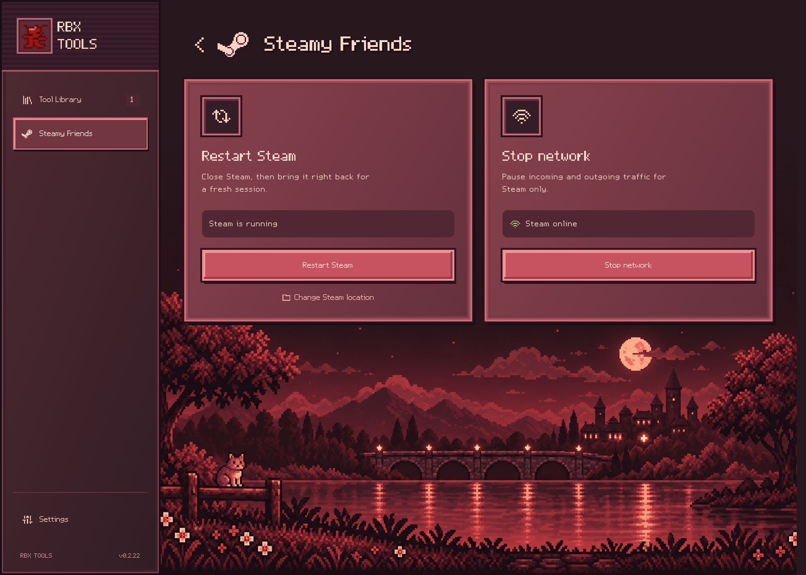
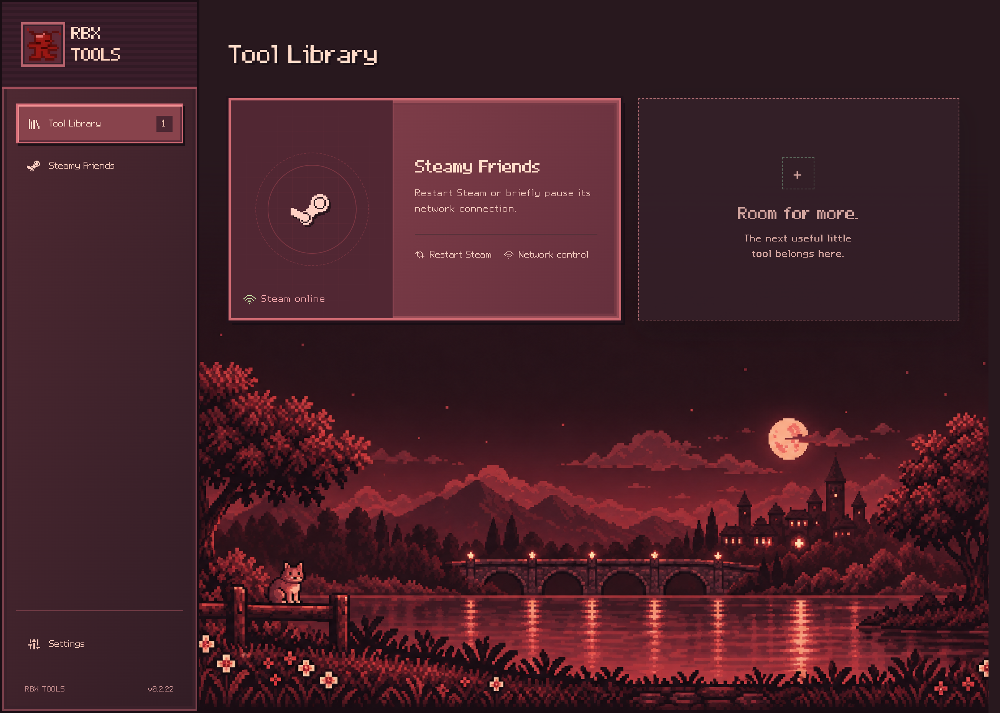
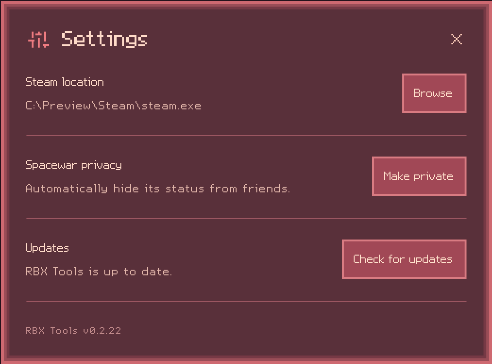

# RBX Tools

**Handy tools for your games, all in one Windows app.**

[Download](https://github.com/Coldobird/RbxTools/releases/latest)

## Get started

1. [Download **RBX-Tools.exe**](https://github.com/Coldobird/RbxTools/releases/latest) from **Assets**.
2. Open it and approve the administrator prompt.
3. Pick a tool from the library.

**Windows 10/11 · 64-bit · No installation needed**

If the app asks for WebView2, [get it from Microsoft](https://developer.microsoft.com/en-us/microsoft-edge/webview2/).

## Steamy Friends

The first tool in the library helps you manage Steam:

- **Restart Steam** with one click.
- **Pause and restore Steam's internet** without disconnecting other apps.
- **Make Spacewar private** in Settings to hide its activity from friends. Steam sign-in may be needed.

Closing RBX Tools removes its network pause. Restarting or pausing Steam may interrupt games, downloads, and chat.

<strong>See the Tool Library and Settings</strong>

### Tool Library

Choose the tool you want to use.

### Settings

Find Steam, manage Spacewar privacy, and check for updates.

## Stay up to date

The app checks for updates automatically. Click **Update** when prompted, or check in **Settings**.
